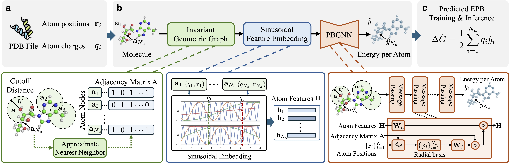

# ❇️ PBGNN: End-to-End Modeling of Reaction Field Energy Using Data-Driven Geometric Graph Neural Networkss



This repository implements **PBGNN**, including data preprocessing, loading, model training, and evaluation. The code is written in Python using PyTorch, enabling rapid prototyping and experimentation.


## Dependencies

### Requirements

- Python >= 3.9
- Install the `slurm` plugin via `pip install wheel/nntool-1.6.2-py3-none-any.whl`
- Install the `pbgnn` package via `pip install -e .`
- Set up the `wandb` and `slurm` fields in the `env.toml` file

## Datasets

To enable better reproducibility, we have provided preprocessed data files for the AMBER/PBSA and PBSMALL datasets. You can access the preprocessed datasets via [Zenodo](https://doi.org/10.5281/zenodo.15867553).

## Training and Testing

To train and test PBGNN on the AMBER/PBSA dataset, run:

```bash
# training
sh scripts/3d/bash/train.sh

# testing
sh scripts/3d/bash/test.sh
```
One is able to modify the predefined configurations by running

```bash
python -m scripts.3d.train_3d_energy_distributed distributed_atomic_all_atoms_grid35_all_in_one_with_lset_fully_coverage_medium_dataloader -h
```
