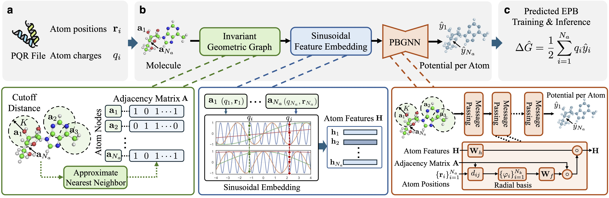

# ❇️ PBGNN: End-to-End Modeling of Reaction Field Energy Using Data-Driven Geometric Graph Neural Networkss



This repository implements **PBGNN**, including data preprocessing, loading, model training, and evaluation. The code is written in Python using PyTorch, enabling rapid prototyping and experimentation.


## Dependencies

### Miniconda

We leverage miniconda as the virtual enviroment manager for python project. Please go to [miniconda installation](https://www.anaconda.com/docs/getting-started/miniconda/install#linux-terminal-installer) to install it in your system.

### Requirements

- Python >= 3.9
- Install the `slurm` plugin via `pip install wheel/nntool-1.6.2-py3-none-any.whl`
- Install the `pbgnn` package via `pip install -e .`
- Set up the `wandb` and `slurm` fields in the `env.toml` file

## Datasets

To enable better reproducibility, we have provided preprocessed data files for the AMBER/PBSA and PBSMALL datasets. You can access the preprocessed datasets via [Zenodo](https://doi.org/10.5281/zenodo.15867553).

After downloading the dataset, put it under the `datasets` folder.

```bash
mkdir -p datasets
cd datasets && wget https://zenodo.org/records/15867553/files/Archive.zip?download=1
```

## Wandb

We use Wandb to record the experiment progress. Please visit [wandb](https://wandb.ai/) to create an account and set up
a project space for pbgnn. Please update your wandb information into the `env.toml` file.

## Slurm

All jobs are using slurm to execute. Please set up your slurm infomation in the `env.toml` file. Please also update the
project path, which should be set up as your absolute path to the pbgnn project.

## Testing and Training

To test PBGNN on the AMBER/PBSA and PBSMALL dataset, please run

```bash
# testing
mkdir -p outputs
sh scripts/3d/bash/test.sh
```
where we have provided two model checkpoints.

To train PBGNN on the custom dataset, please run

```bash
# training
mkdir -p outputs
sh scripts/3d/bash/train.sh
```

One is able to modify the predefined configurations by running

```bash
python -m scripts.3d.train_3d_energy_distributed amber_pbsa -h
```

All arguments can be overrided by passing new argument values, for example,

```bash
python -m scripts.3d.train_3d_energy_distributed amber_pbsa --trainer.train-dataset-extra-config.neighbor-list-cutoff 15 --trainer.eval-dataset-extra-config.neighbor-list-cutoff 15 --trainer.train-num-steps 32000
```